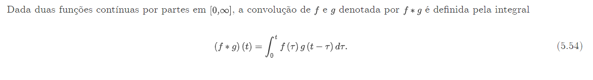

1. FFT é tudo sobre convolução, a multiplicacao de dois polinômios é uma convolução. Mas convolução eu achei mais clean de entender, convolução pode ser feita com funções contínuas ou discretas, a definição
para funções contínuas seria:  entao é meio que multiplicar funções de tal modo que para cada i voce multiplica um N-i, e todos esses caras convergem para um N. 
